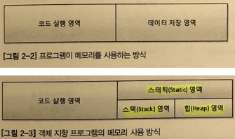

## 자바와 절차적/구조적 프로그래밍
1. 자바 프로그램의 개발과 구동
    - 자바 개발 도구인 JDK를 이용해 개발된 프로그램은 JRE에 의해 가상의 컴퓨터인 JVM 상에서 구동된다.
    - JDK는 자바 소스 컴파일러인 javac.exe를 포함하고, JRE는 자바 프로그램 실행기인 java.exe를 포함하고 있다.
    - 
    - JVM (Java Virtual Machine)
        - 

```uml
Object <|-- Dummy
```

### 프로그램 메모리 사용 방식
<br>


1. 다시 보는 main() 메서드 : 메서드 스택 프레임
    - JRE는 먼저 프로그램 안에 main() 메서드가 있는지 확인한다.
    - main() 메서드의 존재가 확인되면 JVM을 시작시킨다.
    - JVM은 전처리 과정을 진행한다.
        - java.lang 패키지를 스태틱 영역에 가져다 놓는다.
        - 개발자가 작성한 모든 클래스와 임포트 패키지 역시 스태틱 영역에 가져다 놓는다.
    - main() 메서드를 스택 프래임이 스택 영역에 할당한다.
        - 스택 영역에서는 메서드의 시작하는 중괄호를 만날 때마다 스택 프래임이 하나씩 생긴다.
    - main() 메서드의 인자 args를 저장할 변수 공간을 스택 프래임의 맨 밑에 확보한다.
    - main() 메서드의 닫히는 중괄호를 만나면 스택 프레임에서 메서드는 소멸된다.


2. 변수와 메모리
    - main 메서드에 변수를 생성
    - 변수를 초기화 하지 않으면 오류를 발생한다.
        - 초기화 하지 않으면 변수에는 알수 없는 값이 들어간다.
        - 이젠에 해당 공간의 메모리를 사용했던 다른 프로그램이 청소하지 않고 간 값을 그대로 가지고 있기 때문
    - 때문에 메서드 내의 변수는 초기화해줘야 한다.

3. 블록 구분과 메모리
    - if 블록을 메서드에 선언하면 메모리는 어떻게 변할까?
        - if의 시작 중괄호를 만나면 참인 블록의 스택 프래임이 main 메서드의 스택에 중첩되어 생성된다.
        - 닫히는 중괄호를 만나면 if 블록 스택은 사라진다.

4. 지역 변수와 메모리
    - 변수는 세 군데 모두 존재할 수 있다.
    - 지역 변수
        - 지역 변수는 스택 영역, 즉 스택 프래임 안에서 일생을 보낸다. 
        - 스택 프레임이 사라지면 함께 사라진다.
    - 클래스 맴버 변수
        - 클래스 맴버 변수는 스태틱 영역에서 존재한다.
        - 한번 자리잡으면 JVM이 종료될 때까지 고정된 상태로 그 자리를 지킨다.
    - 객체 맴버 변수
        - 객체 맴버 변수는 힙에 존재한다.
        - 객체가 가비지 컬렉터에 의해 사라지면 힙 메모리에서 사라진다.

5. 메서드 호출과 메모리
    - main 메서드에서 다른 메서드를 호출 시, 스택 프레임에는 호출된 메서드가 쌓이게 된다.
    - 여기서는 main 메서드의 지역 변수와 호출된 메서드의 변수명이 같지만 서로 호출 할 수 없는 원리는 설명한다.
        - 이름은 같지만 실제로는 서로 다른 별도의 공간에 존재하기 때문
        - 이것을 값에 의한 호출 (Call by value)라고 한다.


         
    