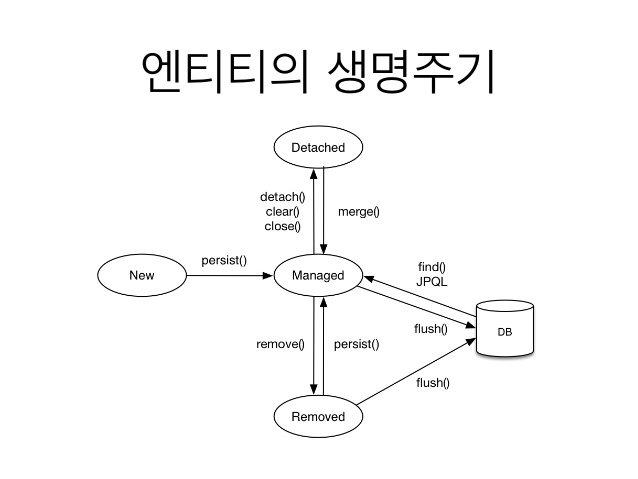

## 영속성 컨텍스트

### 영속성 컨텍스트란
- 엔티티를 영구 저장하는 환경
- 엔티티 매니저로 엔티티를 저장하거나 조회하면 엔티티 매니저는 영속성 컨텍스트에 엔티티를 보관하고 관리한다.
```java
em.persist(member);
```

- persist() 메소드는 엔티티 매니저를 사용해서 회원 엔티티를 영속성 컨텍스트에 저장한다.
- 영속성 컨텍스트는 엔티티 매니저를 생성할 때 하나 만들어진다.
- 엔티티 매니저를 통해서 영속성 컨텍스트에 접근할 수 있고, 영속성 컨텍스트를 관리 할 수 있다.

<br>

### 엔티티의 생명주기
- 엔티티에는 4가지 상태가 존재한다.
    - 비영속(new / transient) : 영속성 컨텍스트와 전혀 관계가 없는 상태
    - 영속(managed) : 영속성 컨텍스트에 저장된 상태
    - 준영속(detached) : 영속성 컨텍스트에 저장되었다가 분리된 상태
    - 삭제 (removed) : 삭제된 상태

<br>




<br><br>


- 비영속
    - 엔티티 객체를 생성했다.
    - 순순한 객체 상태, 아직 저장하지 않음
    - 따라서 영속성 컨텍스트나 데이터베이스와는 전혀 관련이 없다.
    - 이것을 비영속 상태라고 한다.

```java
Member member = new Member();
member.setId("member1");
member.setUsername("회원1");
```

- 영속
    - 엔티티 메니저를 통해서 엔티티를 컨택스트에 저장했다.
    - 이렇게 영속성 컨텍스트가 관리하는 엔티티를 영속 상태라고 한다.
    - 결국 영속 상태라는 것은 영속성 컨텍스트에 의해 관리된다는 뜻
    - em.find()나 JPQL을 사용해서 조회한 엔티티도 영속성 컨텍스트가 관리하는 영속 상태이다.

```java
em.persist(member);
```

- 준영속
    - 영속성 컨텍스트가 관리하던 영속 상태의 엔티티를 영속성 컨텍스트가 관리하지 않으면 준영속 상태가 된다.

<br>

