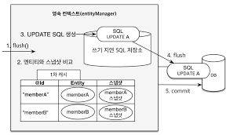

## 영속성 컨텍스트의 특징

### 영속성 컨텍스트의 특징

1. 영속성 컨텍스트의 식별자 값
    - 영속성 컨텍스트는 엔티티를 식별자 값(@Id로 테이블의 기본 키와 매핑한 값)으로 구분한다. 따라서 영속 상태는 식별자 값이 반드시 있어야 한다.
    -  식별자 값이 없으면 예외 발생
2. 영속성 컨텍스트와 데이터베이스 저장
    - JPA는 보통 트랜잭션을 커밋하는 순간 영속성 컨텍스트에 새로 저장된 엔티티를 데이터베이스에 반영한다. 이것을 플러시(flush)라고 한다.
3. 영속성 컨텍스트가 엔티티를 관리하면 다음과 같은 장점이 있다.
    - 1차 캐시
    - 동일성 보장
    - 트랜잭션을 지원하는 쓰기 지연
    - 변경 감지
    - 지연 로딩

<br>

### 엔티티 조회

- 키워드 : 1차 캐시, 동일성과 동등성

### 엔티티 저장

- 키워드 : 쓰지 지연

### 엔티티 수정

- 키워드 : 변경 감지(dirty checking)

<br>

- 변경 감지
    - JPA는 어떻게 수정할까?
```java
// 영속 엔티티 조회
Member memberA = em.find(Member.class, "memberA");

// 영속 엔티티 데이터 수정
memberA.setUsername("hi");
memberA.setAge(10);

// 이런 코드는 없다.
em.update(memberA);

// 트랜잭션 커밋
transaction.commit();
```

- JPA로 엔티티를 수정할 때는 단순히 엔티티를 조회해서 데이터만 변경된다.
- 엔티티의 변경사항을 데이터베이스에 자동으로 반영하는 기능을 `변경감지(dirty-checking)`이라고 한다.



- JPA는 엔티티를 영속성 컨텍스트에 보관할 때, 최초 상태를 복사해서 저장해두는데 이것을 `스냅샷`이라 한다. 그리고 플러시 시점에 스냅샷과 엔티티를 비교해서 변경된 엔티티를 찾는다.
    - 위의 그림을 분석해 보자
        - 트랜젝션을 커밋하면 엔티티 매니저 내부에서 먼저 플러시가 호출된다.
        - 엔티티와 스냅샷을 비교해서 변경된 엔티티를 찾는다.
        - 변경된 엔티티가 있으면 수정 쿼리를 생성해서 쓰기 지연 SQL 저장소에 보낸다.
        - 쓰기 지연 저장소와 SQL을 데이터베이스에 보낸다.
        - 데이터베이스 트랜잭션을 커밋한다.

- 변경 감지는 영속성 컨텍스트가 관리하는 영속 상태의 엔티티에만 적용된다.
- JPA의 기본 전략은 모든 필드를 업데이트하는것이다.
    - 다음과 같은 장점으로 모든 필드를 업데이트 한다.
        - 모든 필드를 사용하면 수정쿼리가 항상 같다.
        - 데이터베이스에 동일한 쿼리를 보내면 데이터베이스는 이전에 한번 파싱된 쿼리를 재사용할 수 있다.


### 엔티티 삭제