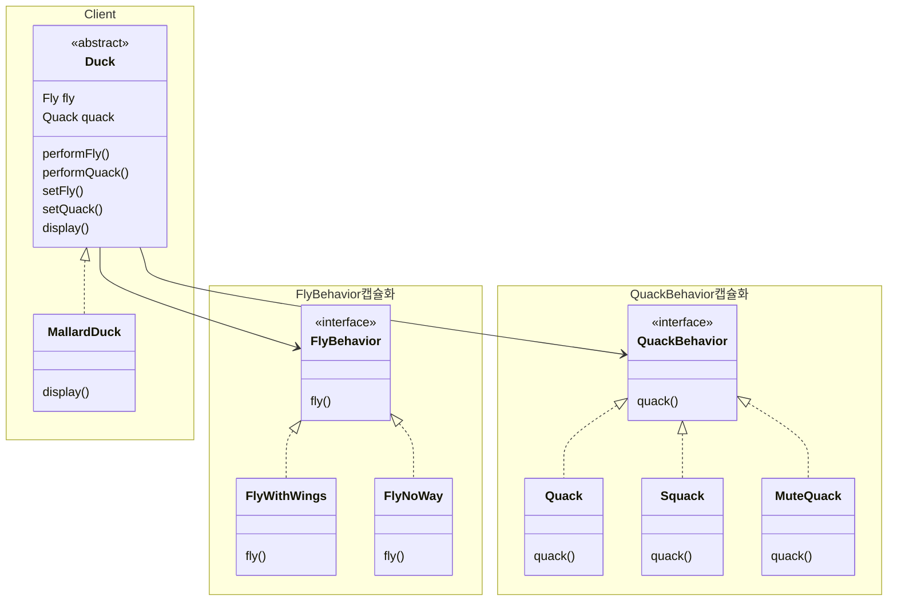

## 전략 패턴

### 전략 패턴이란

알고리즘군을 정의하고 캡슐화해서 각각의 알고리즘군을 수정해서 쓸 수 있게 해 준다. 전략 패턴을 사용하면 클라이언트로부터 알고리즘을 분리해서 독립적으로 변경 가능하다.

### 클래스 다이어그램



### 전략패턴에서의 디자인 원칙

> 애플리케이션에서 달라지는 부분을 찾아내고 달라지지 않는 부분과 분리한다.<br>
> 바뀌는 부분은 따로 뽑아서 캡슐화한다. 그러면 나중에 바뀌지 않는 부분에는 영향을 미치지 않고 그 부분만 고치거나 확장할 수 있다.

> 구현보다는 인터페이스에 맞춰 프로그랠밍한다.

> 상속보다는 구성을 이용하자


### 구성 및 동작원리

`Duck (추상클래스)` 에 필드구성으로 정의된 FlyBehavior와 QuackBehavior를 Duck을 상속받은 `MallardDuck` 의 생성자에서 초기화 한다.

```java
// Duck
public abstract class Duck {

    FlyBehavior flyBehavior;
    QuackBehavior quackBehavior;

    public Duck() {}

    // ...
}

// MallardDuck
public class MallardDuck extends Duck{

    /*
        추상클래스에서 정의된 인터페이스 필드를 원하는 구상 클래스로 초기화 시킨다.
     */
    public MallardDuck() {
        this.flyBehavior = new FlyBehaviorWithWings();
        this.quackBehavior = new RealQuackBehavior();
    }

    @Override
    public void display() {
        System.out.println("mallard duck display");
    }

}
```

구상 클래스의 값을 변경하는 작업은 Dock 에서 정의하면 Duck을 상속받은 모든 클래스에서 사용이 가능하다.

```java
// Duck
public abstract class Duck {

    FlyBehavior flyBehavior;
    QuackBehavior quackBehavior;

    public Duck() {}

    public void performFly() {
        flyBehavior.fly();
    }

    public void performQuack() {
        quackBehavior.makeSound();
    }

    public void swim() {
        System.out.println("수영함");
    }

    // 특정 오리 객체가 생성 후 `날기` 기능을 다시 정의해주는 메서드
    public void setFly(FlyBehavior flyBehavior) {
        this.flyBehavior = flyBehavior;
    }

    // 특정 오리 객체가 생성 후 `소리내기` 기능을 다시 정의해주는 메서드
    public void setQuack(QuackBehavior quackBehavior) {
        this.quackBehavior = quackBehavior;
    }
}

public interface FlyBehavior {
    void fly();
}
public class FlyBehaviorNoWay implements FlyBehavior {
    @Override
    public void fly() {
        System.out.println("no fly");
    }
}
public interface QuackBehavior {
    void makeSound();
}
public class MuteQuackBehavior implements QuackBehavior {
    @Override
    public void makeSound() {
        System.out.println("mute");
    }
}


// 테스트
public class TestSimulation {

    public static void main(String[] args) {
        Duck duck = new MallardDuck();
        duck.performFly();
        duck.performQuack();

        System.out.println();

        // setFly, seteQuack에 Fly, Quack의 다른 구상 클래스를 넣어준다.
        duck.setFly(new FlyBehaviorNoWay());
        duck.setQuack(new MuteQuackBehavior());
        duck.performFly();
        duck.performQuack();
    }

}

```
